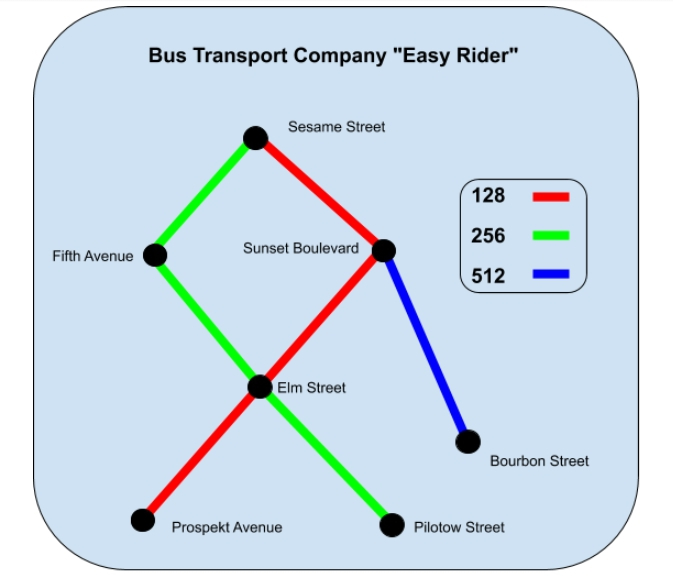
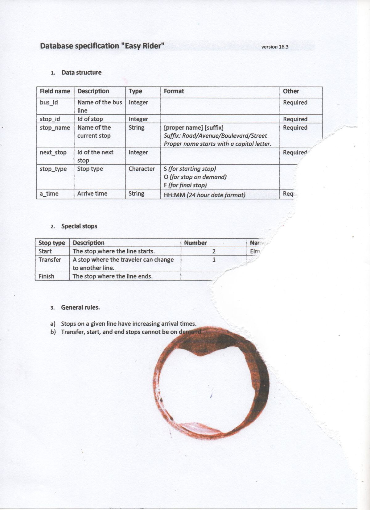

# Easy Rider Bus Company
## About
You've been hired by a bus company that started actively using the internet for business.
Before you came, their database had been updated a few times by various employees with various
levels of skill. Your task is to find all the mistakes they made in the database. Good news:
you have the documentation, but bad news: it's incomplete. Here below is the current state of
available documentation.  

## Description
The string containing the data in JSON format is passed to standard input.
You have to test data consistency and correctness.

## Objectives
1. Check that the **data types** match.
2. Check that the **required fields** are fill in.
4. Check that the data format complies with the documentation.
5. Find the names of all the bus lines.
6. Verify the number of stops for each line.
7. Make sure each bus line has exactly one starting point and one final stop.
8. Count how many starting points and final stops there are.
9. Count the transfer stops.
10. Check that the arrival time for the upcoming stops for a given line is increasing.
11. Check that all the departure points, final stops, and transfer stations are not *"On-demand"*. 
